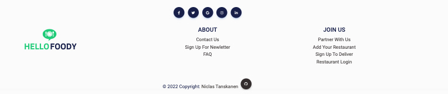

# Hello Foody

The live link can be found here -> [Hello Foody](https://hello-foody.herokuapp.com/)

## Table of Contents
  - [About](#about)
  - [User Goals](#user-goals)
  - [Restaurants Owner Goals](#restaurants-owner-goals)
  - [User Stories](#user-stories)
    - [User](#user)
    - [Restaurant Owner](#restaurants-owner)
    - [Admin](#admin)
  - [Agile Methodology](#agile-methodology)
  - [Design](#design)
    - [Wireframes](#wireframes)
    - [Colour Scheme](#colour-scheme)
    - [Typography](#typography)
    - [Database Schema](#database-schema)
  - [Features](#features)
  - [Technologies Used](#technologies-used)
  - [Features](#features)
  - [Testing](#testing)
    - [Manual Testing](#manual-testing)
    - [Code Validation](#code-validation)
    - [Wave](#wave---web-accessibility-evaluation-tool)
    - [Lighthouse](#lighthouse)
  - [Deployment](#deployment)
  - [Credits](#credits)

## About

The Hello Foody delivery service lets you order food from restaurants, which is then delivered right to your door from Hello Foody.

## User Goals

- Being able to order their favorite dishes from one place
- users can view the entire menu and choose in peace
- user can both order and pay directly on the website.

## Restaurants Owner Goals

- All orders arrive, no risk of missing a call
- Orders are entered directly by customers, no risk of writing down the wrong order
- Possible to communicate with guests about expected delivery time

## User Stories

**Due to the deadline for this project, there are still functions that have not been done.   Marked with *Upcoming updates* as below.**

## User

Acceptance criteria for each user story can be viewed within the linked GitHub issue.

### Completed
- As a user I can see different menu so that can order my food - *Must Have*
- As a user I can choose what payment to use so that I have more flexibility - *Must Have*
- As a User I can sign up for an account so that I can use order food - *Must Have*
- As a User, I can filter for food and restaurants so that I can find what I want to order faster - *Should Have*
- As a User, I can search for food and restaurants so that I can find what I want to order - *Must Have*
- As a User I can comment on my order so that I can specific details for my order - *Must Have*
- As a User I can see my order on email so that can see what I purchase - *Must Have*

### Upcoming updates
- As a user I can see reviews and ratings so I can see what people think - *Should Have*
- As a User I can put items in the shopping cart/Edit/Delete items so that I can see what I want to order before checkout - *Must Have*
- As a User I can see my profile so that I can edit/delete my account - *Must Have*
- As a User I can see previous orders so that I can track what I like to eat - *Should Have*
- As a User I can add my favorites restaurants so that I can find my favorite restaurant fast - *Could Have*
- As a User I can see my active orders so that I can see my order is process - *Must Have*
- As a User I can write reviews so that the restaurant can see what I think, bad or good and improve - *Should Have*
- As a User I can see estimated delivery time so that I see when my food is coming - *Must Have*

## Restaurants Owner
### Completed
- As a restaurant owner I can see placed orders so that I can start cooking - *Must Have*
- As a restaurant owner I can upload pictures to the menu so that customers can see what they order - *Must Have*
- As a restaurant owner I can add/edit/remove items/prices from the menu so that customers can see - *Must Have*
- As a restaurant owner I can see sales statistics so that I can plan my busniess - *Should Have*

### Upcoming updates
- As a restaurant owner I can edit my info about my restaurant so that customers can see up-to-date info - *Must Have*
- As a restaurant owner I can see/approve reviews so that I can improve my restaurant - *Should Have*

## Admin
### Completed
- As a admin I can add/edit/delete restaurant so that I can adapt the page to current restaurant customers - *Must Have*
- As a admin I can edit users so that I can help users - *Must Have*

### Upcoming updates
- As a admin I can see overall statistics so that I have numbers to show new restaurants to work with me*Should Have*

## Agile Methodology

MoSCoW priority was applied to all user stories.

User Stories

 
GitHub Kanban was used to track user stories

Kanban

 
Milestones function in GitHub, worked as Epics

Epic

##### Back to [top](#table-of-contents)

## Design

This site is designed to be viewed on mobile devices. You are taken directly to an app from the website, so the design is similar to an app.

### Wireframes

Desktop

First page

Search page

Checkout page

Thank You page

Mobile

First Page

Restaurants

Search

Login

Cart

Thank You page

 

### Colour Scheme

The colors are simple but still have a sense of seriousness about them

Image

 

### Typography

Google fonts Roboto, 300, 400, 500 & 700 -> https://fonts.google.com/specimen/Roboto?query=Roboto

 

## Database Schema
 IMAGE <------>

## Features

## User

### Home Page

See feature images

 

### Logo & Navigation

See feature images

 

### Footer

See feature images

 

### Restaurants

See feature images

 

### Search / Menu

See Video Gif

 

### Cart

See feature images

 

### Order

See feature images

 

### Order Confirmation

See Video Gif

 

### Order Pay Confirmation

See Video Gif

 

### Profile

See feature images

 

## Restaurant Owner

### Dashboard

See Video Gif

 

### Add Item To Menu

See Video Gif

 

### Edit Menu

See Video Gif

 

### Delete Item

See Video Gif

## Technologies Used

## Features

## Validation

## Testing

### Manual testing

### Code Validation

### Wave - Web Accessibility Evaluation Tool

### Lighthouse

## Deployment

## Credits